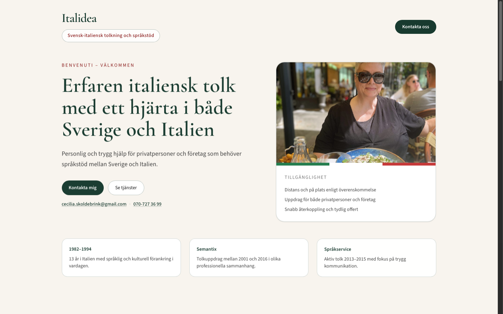
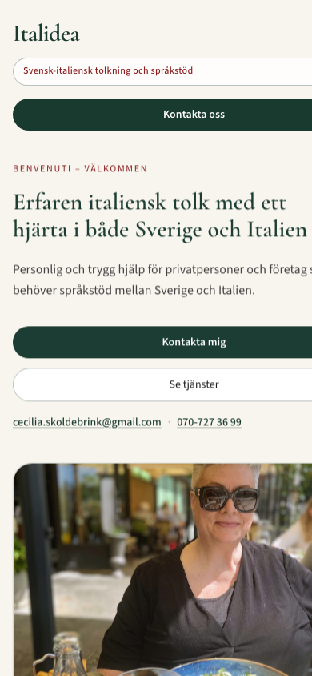
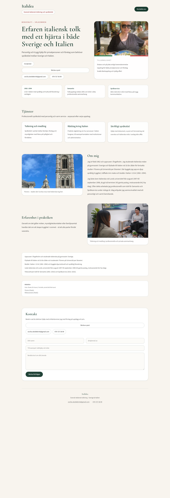

# Italidea Website

Marketing website for **Italidea** — Swedish–Italian interpretation, mediation, and practical language support for private clients and businesses.

### Desktop (1440px)



### Mobile (390px)



## Live site

- **Production:** [italidea.netlify.app](https://italidea.netlify.app/)

## Topics

`nextjs` · `react` · `typescript` · `tailwindcss` · `netlify` · `static-site` · `responsive-design` · `accessibility` · `language-services` · `contact-form`

## Project overview

A warm, Italian-inspired single-page site that helps visitors quickly understand Cecilia Skoldebrink’s services and start a contact request. Content is in Swedish; the visual language uses forest green, terracotta accents, and tricolore details.

| Section | Purpose |
| --- | --- |
| Hero | Value proposition, portrait, quick contact |
| Highlights | Experience summary cards |
| Services | Interpretation, Italy guidance, written support |
| About | Biography and Florence imagery |
| Contact | FormSubmit inquiry form + thank-you page |



## What this demonstrates

- Client-ready marketing site with clear information hierarchy
- Static Next.js export for fast Netlify hosting
- Scroll reveals and subtle hover motion (with `prefers-reduced-motion` support)
- Mobile-first contact CTAs and overflow-safe layout on narrow viewports
- Accessible contact flow with dedicated `/tack` confirmation page
- Royalty-free imagery with source credits

## Tech stack

- Next.js 16 (App Router, static export)
- React 19
- TypeScript
- Tailwind CSS 4
- FormSubmit (contact form delivery)

## Local development

```bash
npm install
npm run dev
```

Open [http://localhost:3000](http://localhost:3000).

## Production build

```bash
npm run build
```

Output is written to `out/` for static hosting.

## Netlify deployment

Configured in [`netlify.toml`](./netlify.toml):

| Setting | Value |
| --- | --- |
| Build command | `npm run build` |
| Publish directory | `out` |
| Site name | `italidea` |

## Contact endpoints

- Email: [cecilia.skoldebrink@gmail.com](mailto:cecilia.skoldebrink@gmail.com)
- Phone: [070-727 36 99](tel:+46707273699)
- Form success redirect: `/tack`

## Screenshots

Captured from the current production build (June 2026) after the mobile overflow and responsive layout fixes.

| View | Preview |
| --- | --- |
| Desktop hero |  |
| Mobile hero (390×844) |  |
| Full page (desktop) |  |

## Repository naming

Canonical repo: **`italidea-website`**. The older name `Italidea` (capital I) is retired in favor of a conventional lowercase GitHub slug.

## License

Client project for Italidea / Cecilia Skoldebrink. Text and portrait assets belong to the client.
